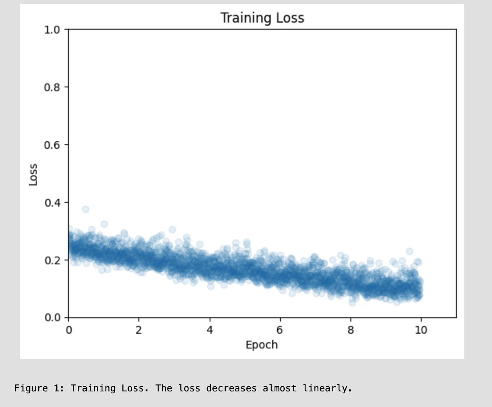
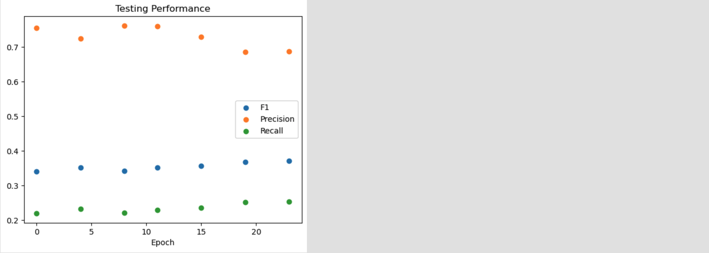

# Bot-or-User_Twitter-Classification

In this repository the Heterogeneous Graph Transformer [1] is applied on the TwiBot-22 Twitter dataset [2] to distinguish bots from real users on the platform.

The focus of this project diverges from classification based on text or images - towards the behavioral and interaction patterns as well as user metadata to distinguish real from fake users.   These patterns are more difficult to camouflage, and thus are a promising direction of research.

**Because:** 
With the increasing effectiveness as well as ease of access to generative AI, such as text and image generation models more sophisticated impersonations and generation of fake media can be achieved, difficult or impossible to distinguish from real content. Malicious-bot operators have gained access to multi-billion dollar means which camouflage their bots' behavior. The generative models, trained with human feedback , effectively to be indistinguishable from real content, diminish the out-of-distribution shift which was previously easily detectable. 

Experiments can be found in the main.ipynb.
  
[1] https://arxiv.org/abs/2003.01332  
[2] https://arxiv.org/abs/2206.04564 

## Experimental Results
Below, the training loss and validation F1 score are shown (Figure 1 and 2). The model is trained for 10 epochs.
One training epoch amounts to 6.8 hours, and total training time to 68 hours on a NVIDIA P100 GPU.

One training epoch corresponds to 810,000 node classifications. The model is trained with the Adam optimizer and a learning rate of 0.0002 and a minibatch size of 32. The evaluation is done on the remaining 90,000 nodes, which the model has not seen.

## Discussion
The model achieves an F1 score of more than 69%, outperforming all models from the original Twibot-22 paper (The best model achieves an F1 score of 58%).
Interestingly, their implementation of the Heterogeneous Graph Transformer architecture only achieves an F1 of 39%. Since a naive logistic regression achieves an F1 score of 43% (as evaluated earlier), the performance of 69% is plausible.

Opposed to the original implementation in Twibot-22, we only utilize the graph information (relationship information) as initial node features. The original implementation also leverages text information from user descriptions and tweets as well as numerical and categorical user property information.

Unfortunately, the original paper lacks a description of data splitting and the training approach or schedule. The performance deviation could be caused by insufficient training in the original paper's case.
Inspecting Figure 2, the F1 score only increases after the model has trained by making at least 810,000 classifications (one epoch). Perhaps the authors limited the training, since the main subject of the Twibot-22 paper is the dataset itself, and the authors had to compare many different models. They provide the testing performance in comparison to earlier datasets in the field, such that their results are still interpretable.
